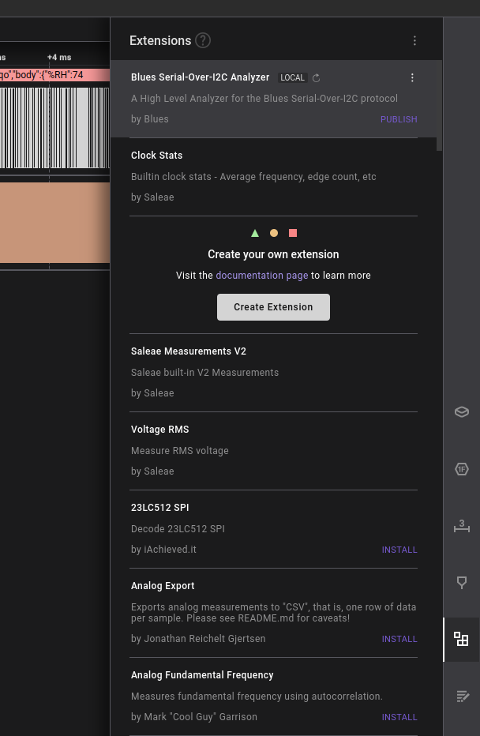
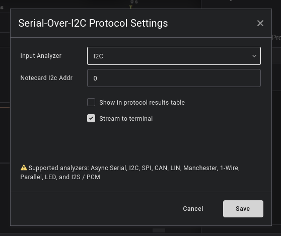
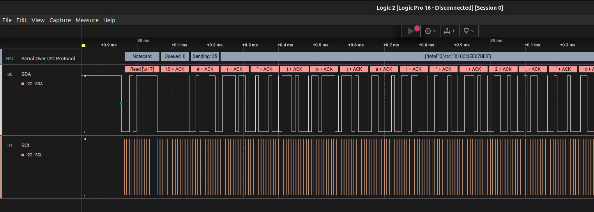
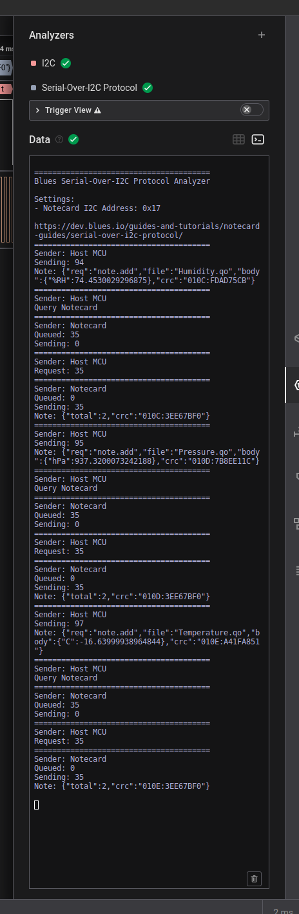

Serial-over-I2C Protocol Analyzer
=================================

This repository provides an extension to the Saleae Logic application to support on the wire inspection of the Blues Serial-over-I2C protocol.

Getting started
---------------

To install the extension, navigate to the "Extensions" tab in Saleae Logic application.

This extension is known as a High Level Analyzer. This means the analyzer performs further analysis beyond a Low Level Analyzer (i.e. I2C).

In order to use this extension, you must first enable the I2C analyzer. Then you may enable this extension and bind it to the I2C analyzer in the settings pane.

> _**NOTE:** When enabling the extension, you will be prompted to enter the I2C Address of the Notecard. If you wish to use the Notecard's default address (23), you can leave this value marked zero (0)._

> _**WARNING:** If the I2C address of the Notecard does not match the value supplied to the extension, then all traffic will be ignored._

Using the extension
-------------------

Once you have enabled the extension, you will see a new row in the UI that describes the behavior of the Serial-Over-I2C protocol.

You may also look at the Terminal output of the Analyzers panel to see the dialogue between the Notecard and Host MCU.

Having Trouble?
---------------

If you encounter any problems, you may file an issue on the [GitHub repository](https://github.com/blues/saleae-logic-extension.git), or ask any questions in our [Community Forum](https://discuss.blues.com/).
